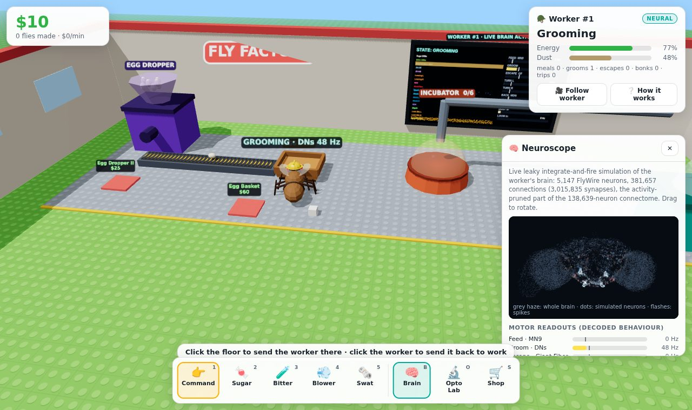
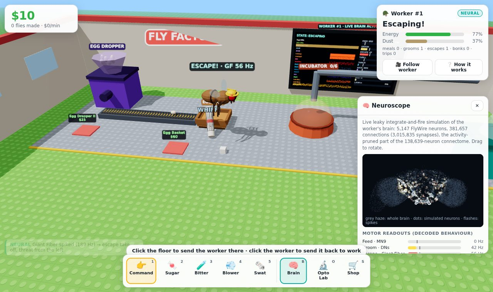

# 🪰 Fly Factory Tycoon

A small Roblox-tycoon-style 3D factory where **you boss around a fruit fly whose brain is a live
connectome simulation**. The worker fly carries eggs to incubators and every hatched baby fly pays
out. You can feed it, spray it, blow dust off it, swat at it, or rewire its neurons in the Opto Lab.

The worker runs on the **FlyWire whole-brain connectome** (FAFB v783) with the leaky
integrate-and-fire model of [Shiu et al. 2024, *Nature*](https://github.com/philshiu/Drosophila_brain_model),
the same model used by Eon Systems' [`fly-brain`](https://github.com/eonsystemspbc/fly-brain).
It runs in real time in a Web Worker in your browser, with no server. The baby flies it produces
are decoration only; only the worker has a brain.



## What the brain decides (and what it doesn't)

Every frame, the game turns what is happening around the fly into **Poisson spike trains on real
sensory neurons**. It then reads **real descending and motor neurons** back out. The status badge in
the HUD shows whether the current action is `NEURAL` or `SCRIPTED`.

| Behaviour | Sensory input (FlyWire cell types) | Readout that drives it |
|---|---|---|
| **Eating** | sugar cube at the mouth → 20 labellar sugar GRNs (Shiu et al. set) | **MN9** proboscis motor neuron. Proboscis extension is proportional to MN9 rate; energy is gained per MN9 spike |
| **Refusing food** | bitter spray / laced sugar → 32 bitter GRNs (LB1a–e) | bitter input suppresses MN9 through the connectome (sugar + bitter gives MN9 ≈ 0 Hz) |
| **Grooming** | dust on the fly (and leaf-blower air) → 503 head-bristle + JO-F mechanosensory neurons | 4 **grooming descending neurons** (DNg15, DNg84, DNg85, DNge036, picked from data). Grooming bouts start and stop on their own and clear the dust |
| **Escape take-off** | newspaper swat: its angular size in each eye → LC4 + LPLC2 looming neurons (left/right) | **Giant Fiber (DNp01)**. The escape direction comes from left vs right looming DNs (DNp02/04/11) |
| **Turning away** | same looming input | **DNa02** on the opposite side (an emergent result of the connectome) |
| **Moonwalk / sprint / spin** | Opto Lab | **MDN**, **DNp09**, **DNa02/DNa01** |

Walking between the tray and the incubators is game logic. So are hunger (the energy meter), the
economy, and the baby-fly swarm. Olfactory and visual navigation is unreliable in this LIF model
(it has no neuromodulation and no spontaneous activity), so it is not used for steering the work
loop.

Behaviour is **not deterministic**. Sensory drive is Poisson, so spike timing differs every time.
Whether a slow or fast swat is dodged, when a grooming bout starts, and whether a half-eaten cube is
still worth eating all depend on the spikes. In the 🔬 **Opto Lab** you can drive or silence any
population, exactly like Shiu et al.'s `run_exp`. For example, silence MN9 and the fly starves next
to its food, or silence the Giant Fiber and it can be swatted every time.



## How the brain fits in a browser

The full model has 138,639 neurons and 15,091,983 connections, which is too big to ship. However,
**a neuron that never spikes cannot influence anything**. So `tools/build_connectome.py` works like this:

1. It runs the **full brain** offline with a numba re-implementation of the Shiu model
   (`tools/lif_ref.py`). It uses the same constants and the same Brian2 step order:
   state update → threshold → delayed synapses + Poisson → reset, with exact integration.
   It does this for every stimulus the game can produce (each input over its range, combinations,
   everything at once, and every Opto Lab activation), with several seeds each.
2. It keeps every neuron that spiked in any run, plus every synapse among them. The result is
   **5,147 neurons, 381,657 connections (3.0 M synapses)**, about 1.5 MB.
3. It validates the result (see [`docs/validation.md`](docs/validation.md)):
   - With identical seeds, the subnetwork reproduces the full brain's spike count **exactly for
     every neuron**.
   - On held-out seeds and rates, readout rates stay within **2.3 Hz** of the full brain.
4. The browser engine (`src/brain/engine.ts`) implements the same algorithm. It is event-driven:
   only neurons that are away from rest get updated. Unit tests check it against the Python
   reference:

| condition | readout | Python full brain | browser engine |
|---|---|---|---|
| sugar 150 Hz | MN9 | 78.5 Hz | 81.8 Hz |
| sugar + bitter | MN9 | 0.5 Hz | 1.1 Hz |
| dust 80 Hz | grooming DNs | 229.1 Hz | 227.5 Hz |
| looming both eyes | Giant Fiber | 264.5 Hz | 265.1 Hz |
| looming both eyes | MDN | 20.8 Hz | 20.6 Hz |
| Opto MDN 150 Hz | MDN | 144.5 Hz | 146.6 Hz |

Bitter GRNs at 150 Hz can stochastically ignite a runaway loop in the model: SMP108 → SMP177 →
dopaminergic PPL107/SIP087, which recruits more than 10k neurons. To avoid that, the game caps every
input at a validated **operating envelope**:

| input | cap |
|---|---|
| sugar | 150 Hz |
| bitter | 100 Hz |
| dust | 80 Hz |
| wind | 120 Hz |
| looming | 150 Hz |

No pruning condition ignited inside the envelope. Decoder thresholds are 25% of each readout's rate
under its canonical stimulus.

## Playing

| Tool | Key | What it does |
|---|---|---|
| 👉 Command | 1 | click the floor: "go stand there"; click the worker: "back to work" |
| 🍬 Sugar | 2 | drop a sugar cube (drop it right in front of its mouth when it's exhausted) |
| 🧪 Bitter | 3 | bitter mist: stops snacking and laces nearby sugar |
| 💨 Blower | 4 | hold and drag: blows dust off and stimulates antennae and bristles |
| 🗞️ Swat | 5 | swing a rolled newspaper at the worker |
| 🧠 Brain | B | Neuroscope: 3D spiking brain at the real FlyWire neuron positions, motor meters, raster |
| 🔬 Opto Lab | O | activate or silence any population |
| 🛒 Shop | S | upgrades (also shown as glowing pads on the floor) |

Progress is saved in your browser.

## Development

```bash
npm install
npm run dev          # http://localhost:5173
npm test             # engine, parity, decoder and economy tests (vitest)
npm run build        # dist/ (static site)
npm run build:single # dist-single/index.html, everything inlined in one file
npm run e2e          # after `npm run build`: headless Chromium smoke test of the neural behaviours
                     # (uses /opt/pw-browsers/chromium, or set CHROMIUM=/path/to/chrome)
```

To rebuild the brain from the raw connectome (downloads about 130 MB, takes about 5 minutes on 4 cores):

```bash
pip install -r tools/requirements.txt
npm run brain        # writes src/data/* and docs/validation.md
```

```
tools/            offline pipeline: fetch data, reference LIF (numba), prune + validate + export
src/brain/        engine.ts (LIF), host.ts (real-time loop), brain.worker.ts, client.ts, decoder.ts
src/game/         workerFly.ts (sensory encoding + behaviour arbitration), production, economy, boss tools
src/world/        three.js scene: factory, procedural low-poly fly rig, swarm, effects, labels
src/ui/           HUD, Opto Lab, shop, Neuroscope (brain point cloud, meters, raster, wall monitor)
src/data/         generated brain files (committed)
tests/            vitest unit tests + e2e/smoke.mjs (Playwright)
```

## Credits and licenses

- Connectome: **FlyWire** FAFB v783. Dorkenwald et al. 2024 and Schlegel et al. 2024, *Nature*.
  Data under CC-BY 4.0. Cell-type annotations come from
  [flyconnectome/flywire_annotations](https://github.com/flyconnectome/flywire_annotations).
- Brain model and the connectivity/completeness tables: **Shiu et al. 2024**, *Nature*,
  [philshiu/Drosophila_brain_model](https://github.com/philshiu/Drosophila_brain_model) (MIT).
- Inspired by Eon Systems' embodied fly emulation. This project is not affiliated with Eon Systems.
- Code in this repository: MIT (see `LICENSE`).
